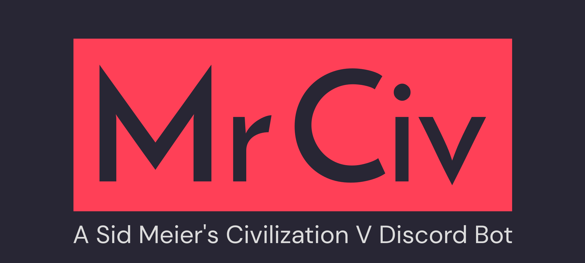

# About

A Discord bot to assist with various Sid Meier's Civilization V tasks such as randomizing a civilization before launch, ultimate bravery and more.

## Requirements

- Node v16.9.0 or higher

## Getting started

To get the Discord bot running, you need to do the following:

1. Setup a Discord bot and getting the token (see https://discordjs.guide/preparations/setting-up-a-bot-application.html for more information) and adding it to `.env` in the projects root folder. See below for an example:

```
BOT_TOKEN=<INSERT TOKEN>
GUILD_ID="INSERT SERVER ID"
```

2. Run the necessary commands:

```
# Install all the necessary dependencies
$ npm install

# Build the project
$ npm run build

# Start the bot
$ npm start
```
